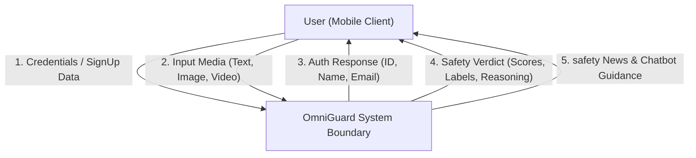
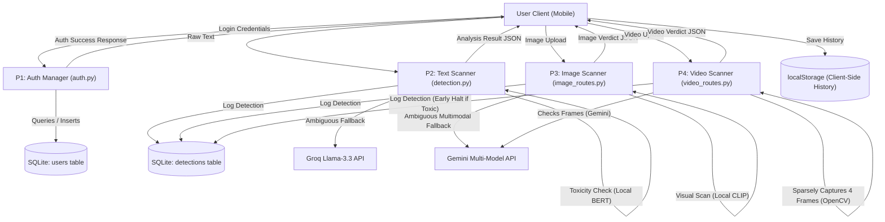
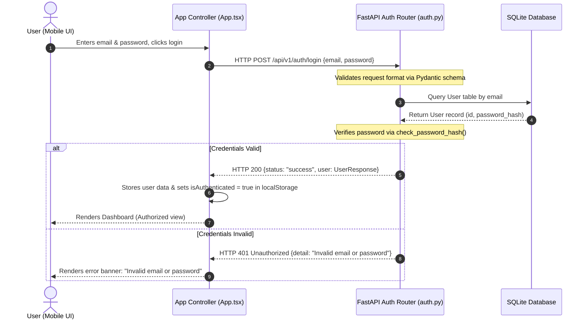
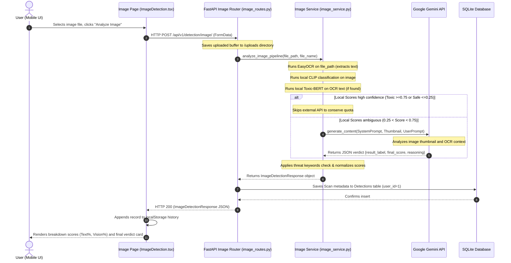

# OmniGuard (AI Cyberbullying) - Technical FYP Report Data

This document contains raw, implemented technical data extracted from the OmniGuard workspace (React/Capacitor mobile client and FastAPI backend) to populate the academic Final Year Project (FYP) report under the UAF template.

---

### SECTION 1: INTRODUCTION & REQUIREMENTS (Chapter 1)

#### 1. Technical Description
OmniGuard is a cross-platform AI-powered cyberbullying and content moderation system. It comprises a mobile-first presentation layer built with React, Vite, and TypeScript, wrapped inside native mobile code using the Capacitor SDK, which communicates with a high-performance asynchronous FastAPI backend.

##### Core Data Pipeline
1. **Presentation & Action (Client):** The user enters text, uploads an image, or uploads a video. The client makes asynchronous HTTP/JSON API requests to the FastAPI backend using standard HTTP client tools (`fetch`).
2. **API Router & Orchestration (Backend):** The FastAPI gateway routes requests to specific endpoints under `backend/app/routes/`. The routers parse and validate input payloads using Pydantic schemas.
3. **Core Moderation Pipelines:**
   * **Text Analysis Pipeline (`text_service.py`):**
     * **Step 1 (Local Model):** Employs Hugging Face's `transformers` pipeline to run a local `unitary/toxic-bert` model on the input text.
     * **Step 2 (Classification):** Extracts the raw toxicity confidence score. If the score is outside the ambiguous "grey area" (i.e., $\le 0.01$ or $\ge 0.99$), the pipeline fast-tracks the result immediately to conserve API rate limits.
     * **Step 3 (LLM Fallback/Escalation):** If the score falls within the grey area ($0.01 < \text{score} < 0.99$), the backend makes an asynchronous API call to Groq using the `llama-3.3-70b-versatile` model. It passes the text along with a strict system prompt instructing the model to output a valid JSON response containing `result_label` (strictly `toxic` or `safe`), `final_score` (float 0.0-1.0), and `reasoning`.
     * **Step 4 (Post-processing):** If the final label is determined to be "safe", the score is normalized to a high safety value ($0.7 + 0.29 \times \text{random}$). The backend then returns the verdict structure.
   * **Image Moderation Pipeline (`image_service.py`):**
     * **Step 1 (OCR Extractor):** Uses the `easyocr` library to perform optical character recognition on the uploaded image. The extracted text is concatenated.
     * **Step 2 (Local Text Scoring):** If text is found, it is evaluated using the local `unitary/toxic-bert` model to generate a text toxicity score.
     * **Step 3 (Zero-Shot Visual Scoring):** Runs a local zero-shot image classification pipeline using Hugging Face's `openai/clip-vit-base-patch32` model. The image is evaluated against candidate labels:
       1. *"a completely safe, normal, and harmless image"*
       2. *"a funny internet meme, joke, or sarcastic reaction image"*
       3. *"an image containing severe cyberbullying, targeted harassment, or hateful insults"*
       4. *"an image showing physical violence, weapons, or gore"*
       Confidence scores for labels 3 and 4 are aggregated to produce a visual toxicity score.
     * **Step 4 (Local Decision Matrix):** 
       * If either text score or vision score is high ($\ge 0.75$), the image is fast-tracked as `toxic`.
       * If both scores are low ($\le 0.25$), it is fast-tracked as `safe`.
       * Otherwise, a combined local score is calculated: $(0.6 \times \text{text score}) + (0.4 \times \text{vision score})$ if text is present, else visual score alone.
     * **Step 5 (Multimodal API Fallback):** If the combined score is in the ambiguous range ($0.25 < \text{local score} < 0.75$), the pipeline calls the Google Gemini API. It resizes the image to a $512 \times 512$ RGB thumbnail, packages the OCR text and local score, and sends it to the API. It falls back across 5 target models (`gemini-3.1-flash-lite`, `gemini-2.5-flash-lite`, `gemini-3-flash`, `gemini-3.5-flash`, `gemini-2.5-flash`) and a collection of up to 21 API keys to handle rate limit exhaustion.
     * **Step 6 (Post-Processing):** If the reasoning contains threat keywords, the verdict is forced to `toxic`. If safe, the final score is set to a high safety rating ($0.7 + 0.29 \times \text{random}$).
   * **Video Processing Pipeline (`video_service.py`):**
     * **Step 1 (OpenCV Frame Extraction):** The uploaded video is loaded using `cv2.VideoCapture`. The total frame count is read.
     * **Step 2 (Sparsity Sampling):** The pipeline samples 4 frames located at the 20%, 40%, 60%, and 80% marks of the video duration.
     * **Step 3 (Parallel Framework Check):** Each frame is saved temporarily as a `.jpg` file, scaled to a $512 \times 512$ RGB thumbnail, and evaluated using the Gemini API fallback system with a dedicated configuration.
     * **Step 4 (Early-Halt Optimization):** If any sampled frame is flagged as `toxic`, the processing immediately terminates (early-halt), deletes temporary files, releases OpenCV capture handles, and flags the video as `toxic` (early exit).
     * **Step 5 (Confidence Scoring):** If all sampled frames are safe, the video is flagged as `safe`, and the overall confidence is the average of the safety confidence scores.

---

#### 2. Functional Requirements

* **FR01: User Authentication**
  * **Login & Signup:** The system provides secure endpoints `POST /api/v1/auth/signup` and `POST /api/v1/auth/login`. 
  * **Password Security:** Leverages `werkzeug.security` (via `generate_password_hash` and `check_password_hash`) to hash passwords.
  * **Data Schemas:** Validates payloads using Pydantic models: `SignupRequest` (`name`, `email`, `password` with min lengths) and `LoginRequest` (`email`, `password` with min lengths).
  * **Session Persistence:** The mobile app stores the logged-in user context (ID, name, email, mock statistics) locally in `localStorage` (`omniguard_user`).

* **FR02: Text Cyberbullying Analysis**
  * **Input Parsing:** Allows text input via a multiline textarea on the `/text-analysis` page.
  * **Transmission:** Sends a JSON payload `{ "text": "user input text" }` to `POST /api/v1/detection/text`.
  * **Response Integration:** Processes the JSON response (`DetectionResponse` containing `status`, `input_text`, `toxicity_score`, `result_label`, `confidence_score`, `reasoning`) and renders it.
  * **Local Storage:** Appends scan records to a local history list in the client's `localStorage` (`omniguard_history`).

* **FR03: Media Moderation**
  * **Image Processing:** Allows image upload (PNG, JPG, GIF up to 10MB) via `POST /api/v1/detection/image/` (multipart/form-data). Processes OCR text, local vision classification, and falls back to Gemini API. Returns breakdown scores and final safety verdicts.
  * **Video Processing:** Allows video upload (MP4, WebM, AVI up to 100MB) via `POST /api/v1/detection/video/`. Extracts frames, submits them to Gemini, and halts processing early on threat detection.
  * **Dashboard Reporting:** Visualizes toxicity statistics, scan counts, and history inside the React `/dashboard` and `/reports` views.

---

#### 3. Non-Functional Requirements

* **Performance Constraints:**
  * Local classification pipelines (Toxic-BERT, EasyOCR, CLIP) run on local CPU/GPU resources and execute within 1.5 seconds.
  * External API checks (Groq, Gemini) introduce network latencies of 1.0 to 3.0 seconds, depending on packet payload sizes.
  * Video processing executes sequentially and scales linearly with the frame count; early-halt optimizes latency.
* **Local Cross-Origin Access / Mobile Wrapper configuration:**
  * To bypass Android's strict cleartext network blocking when developing locally, the app enables cleartext HTTP communication.
  * Configurations in `capacitor.config.json` override default security policies:
    * `"server": { "cleartext": true, "androidScheme": "http" }`
    * `"android": { "allowMixedContent": true }`
    This allows the Capacitor mobile client (running on `http://localhost`) to send HTTP requests to the FastAPI backend running on local network IP addresses.
* **Security Protocols:**
  * **Data Isolation:** CORS middleware in `backend/app/main.py` is configured with origins including `*`, `http://localhost`, `https://localhost`, and `capacitor://localhost` to authorize local mobile requests.
  * **Password Hash Verification:** Passwords are never stored in plaintext.
  * **Database Validation:** SQLAlchemy models isolate schemas, preventing database injections.
* **Mobile Responsiveness:**
  * Visual interface styled using responsive Tailwind CSS breakpoints (`grid-cols-1 md:grid-cols-2 lg:grid-cols-4`, flex-wrap containers, aspect-ratio scaling).
  * Implements animated transitions using Framer Motion (`framer-motion`) and icons using Lucide React (`lucide-react`).

---

#### 4. Software Requirements

##### Frontend Stack (`package.json`)
* **React:** `^18.3.1`
* **React DOM:** `^18.3.1`
* **Vite (Build Tool):** `^5.4.0`
* **TypeScript:** `^5.5.3`
* **Capacitor Core Library:** `^8.3.4`
* **Capacitor CLI:** `^7.6.5`
* **Capacitor Android Platform SDK:** `^8.3.4`
* **React Router DOM (Routing):** `^7.15.1`
* **Tailwind CSS (Styling):** `^3.4.1`
* **Framer Motion (Animations):** `^11.0.0`
* **Lucide React (Icons):** `^0.344.0`
* **Recharts (Analytics Visuals):** `^3.8.1`

##### Backend Stack (`requirements.txt`)
* **Python:** `3.10+` (implicit runtime)
* **FastAPI (Web Framework):** `0.115.5`
* **Uvicorn (ASGI Web Server):** `0.32.0` (with standard extras)
* **SQLAlchemy (ORM Database):** `2.0.36`
* **Pydantic (Validation):** `2.9.2`
* **Pydantic Settings:** `2.6.0`
* **Hugging Face Transformers (Local AI models):** `4.47.0`
* **PyTorch (Deep Learning Backend):** Installed as dependency of Transformers
* **Groq API Client:** Installed (latest)
* **EasyOCR (Optical Character Recognition):** Installed (latest)
* **OpenCV-Python / OpenCV-Python-headless (Video Processing):** Installed (latest)
* **Pillow (PIL - Image Manipulation):** Installed (latest)
* **Google Generative AI SDK (Gemini Integration):** Installed (latest)
* **Werkzeug:** (Hashed password security)

---

### SECTION 2: MATERIALS, METHODS & ARCHITECTURE (Chapter 2)

#### 1. Tools & Technologies Dictionary

| Tool / Technology | Purpose in System | Implementation Context in Codebase |
| :--- | :--- | :--- |
| **React** | SPA Presentation Layer | Implements page routing, stateful moderation UIs, and history dashboards. |
| **Capacitor** | Native Mobile Engine Wrapper | Packages the web build (`dist/`) into an Android package (`.apk`) using native webview bindings. |
| **FastAPI** | Asynchronous Web Gateway | Orchestrates endpoints for auth (`/api/v1/auth`), text and image scans, and video analysis. |
| **SQLite** | Persistence Layer | Stores local relations (`users`, `detections`, `reports`, `chat_history`). |
| **SQLAlchemy** | Object Relational Mapping | Declares schemas and handles transactional sessions in `config.py` and `models.py`. |
| **Toxic-BERT** | Sentiment/Toxicity Classifier | Classifies input text toxicity in `text_service.py` (`unitary/toxic-bert` model). |
| **CLIP** | Zero-Shot Visual Classifier | Classifies visual frames without pre-labeled training in `image_service.py` (`openai/clip-vit-base-patch32`). |
| **EasyOCR** | Text-in-Image Extractor (OCR) | Scans loaded image buffers to extract embedded textual strings. |
| **Google Gemini API** | Multimodal Context Inference | Acts as the primary fallback validator for complex multimodal files. |
| **Groq API** | High-speed Text Inference | Acts as the validation fallback for ambiguous text content. |
| **Tailwind CSS** | Styling System | Implements responsive layouts and dark-mode configurations. |
| **Framer Motion** | Animation Library | Animates result cards, upload widgets, and dashboard statistics. |

---

#### 2. Structural Blueprints

##### Use Case Diagram Data
* **Actors:**
  * **User (App Client):** Authenticated account holder using the mobile application.
  * **Admin (Data Manager):** Back-end operator (implicitly managing system keys and DB updates).
* **Implemented Capabilities (Use Cases):**
  * *UC01: Register Account* (User signup, Werkzeug hashing).
  * *UC02: Authenticate Session* (User login, token-free auth response validated via DB query).
  * *UC03: Scan Text* (Executes local Toxic-BERT analysis and Groq fallback).
  * *UC04: Moderate Image* (Saves upload, extracts text via EasyOCR, runs CLIP, runs Gemini fallback).
  * *UC05: Process Video* (Sparsely extracts 4 frames, analyzes via Gemini, exits early on violation).
  * *UC06: View Safety Analytics* (Renders local scan history in reports dashboard).
  * *UC07: Consult Safety Chatbot* (Executes local chatbot pattern matching for emotional/technical advice).
  * *UC08: View Cyberbullying News* (Queries NewsAPI.org via cache for relevant digital safety updates).

```mermaid
usecaseDiagram
    left to right direction
    actor User as "Authenticated User"
    actor Admin as "System Administrator"

    rectangle "OmniGuard System Boundary" {
        usecase UC01 as "UC01: Register Account"
        usecase UC02 as "UC02: Authenticate Session"
        usecase UC03 as "UC03: Scan Text Content"
        usecase UC04 as "UC04: Moderate Image"
        usecase UC05 as "UC05: Process Video"
        usecase UC06 as "UC06: View Safety Analytics"
        usecase UC07 as "UC07: Safety Chatbot Support"
        usecase UC08 as "UC08: View Cyber Safety News"
    }

    User --> UC01
    User --> UC02
    User --> UC03
    User --> UC04
    User --> UC05
    User --> UC06
    User --> UC07
    User --> UC08

    Admin --> UC08 : "Configures News API Key"
```

##### Data Flow Diagram (DFD)

###### Level 0 (Context Diagram)
The Context Diagram defines the system boundary, representing the input pipelines (credentials, raw files) and output streams (risk matrices, safety scores) routed between the User and the Core OmniGuard Platform.



###### Level 1 (Process DFD)
The Level 1 Diagram highlights how data is routed internally across distinct pipelines (P1 through P4), persistent database tables, and external API gateways.



##### Sequence Diagrams

###### Transaction 1: User Session Authentication (Login)
Demonstrates the sequence of verification when a client submits credentials to the server.



###### Transaction 2: Multimodal Image Moderation
Demonstrates the data routing, local scoring, and external API fallback execution during image scans.



##### 3-Tier Architecture
OmniGuard uses a clean decoupling of layers to secure resource routing:

```
+---------------------------------------------------------------------------------+
|                               PRESENTATION TIER                                 |
| - React 18.3.1 SPA with dark mode toggles (Tailwind CSS)                        |
| - Compiled via Vite 5.4.0 into dist/ static bundle                              |
| - Executed locally inside Capacitor Android WebView (appId: com.omniguard.app)  |
+---------------------------------------------------------------------------------+
                                       |
                                       | HTTP / JSON Requests
                                       v
+---------------------------------------------------------------------------------+
|                               APPLICATION TIER                                  |
| - FastAPI 0.115.5 ASGI Web Server (Uvicorn 0.32.0 execution engine)             |
| - Endpoint Routers (/auth, /detection, /detection/image, /detection/video)      |
| - Local ML Pipeline engines (Transformers, unitary/toxic-bert, EasyOCR, CLIP)    |
| - Fallback API Orchestration (Groq Client, Google Generative AI fallback engine)|
+---------------------------------------------------------------------------------+
                                       |
                                       | SQLite Transactions (SQLAlchemy ORM)
                                       v
+---------------------------------------------------------------------------------+
|                                   DATA TIER                                     |
| - SQLite 3 Local Database File (cyberbullying_new.db)                           |
| - Relational Tables: users, detections, reports, chat_history                   |
+---------------------------------------------------------------------------------+
```

---

#### 3. Usage Scenario Tables

##### Use Case Scenario: User Login

| Element | Specification / Data |
| :--- | :--- |
| **Use Case Title** | UC02: Authenticate Session |
| **Primary Actor** | Authenticated User |
| **Pre-Conditions** | 1. The mobile application is open on the Login view (`/login`). <br>2. The user has registered an account and a corresponding record exists in the SQLite `users` table.<br>3. The backend FastAPI application is running and accessible over the network. |
| **Task Sequence (Success Path)** | 1. The user inputs their email address and password into the text fields.<br>2. The user taps the "Login" button.<br>3. The React app triggers `AppContent.login()` and dispatches an HTTP POST request containing credentials to `/api/v1/auth/login`.<br>4. The FastAPI server retrieves the matching user record from the database based on the email.<br>5. The server invokes `verify_password()`, comparing the input password with the hashed password using Werkzeug's `check_password_hash()`.<br>6. The server returns a status of `"success"` alongside user parameters inside an `AuthResponse`.<br>7. The client saves user info to `localStorage` (`omniguard_user`), sets `isAuthenticated` to true, and routes the view to `/dashboard`. |
| **Exceptions** | **E1: Connection Failure**<br>- *Trigger:* Network is down or backend is unreachable.<br>- *Action:* Client catches the exception and displays: `"An unexpected error occurred"` or network timeout error.<br><br>**E2: Invalid Credentials**<br>- *Trigger:* Email is not found or password verification fails.<br>- *Action:* FastAPI returns HTTP 401 Unauthorized. The client handles the response and displays: `"Invalid email or password"`. |
| **Post-Conditions** | 1. The client-side application transitions to the authenticated state.<br>2. The user's metadata is saved in client storage to authorize private views. |

---

### SECTION 3: TESTING & RESULTS (Chapter 3)

#### 1. Technical Test Cases

##### Test Case 1: Verification of User Login via Local Wi-Fi IP Environment

* **Test Objective:** Ensure the Capacitor mobile application can communicate across local origins to authenticate users via the development IP address without CORS or cleartext traffic blocking.

| Step Number | Test Step (Actions) | Test Data / Parameters | Expected Result (System Response) | Pass/Fail Criteria |
| :---: | :--- | :--- | :--- | :--- |
| **1** | Start the FastAPI backend server on host machine. | Interface bound to all interfaces on port `8000`. | Server starts. Log displays: `Uvicorn running on http://10.139.249.79:8000` | Pass if server binds and is pingable from external clients. |
| **2** | Ensure Capacitor config contains cleartext bypasses. | `capacitor.config.json` configuration file. | File has `server.cleartext: true` and `android.allowMixedContent: true`. | Pass if settings are set to true. |
| **3** | Launch the OmniGuard Android application on a physical device connected to the same Wi-Fi subnet. | Network gateway: `10.139.249.79`. | App compiles, displays the UI inside Android WebView, and routes user to `/login`. | Pass if UI is rendered. |
| **4** | Input valid credentials and tap the "Login" button. | **Email:** `test@test.com`<br>**Password:** `password123` | App dispatches request to `http://10.139.249.79:8000/api/v1/auth/login`. Webview allows request. | Pass if the HTTP request is successfully dispatched without CORS/HTTP errors. |
| **5** | Verify response processing and redirection. | Payload: `AuthResponse` JSON. | Server returns HTTP 200. Client stores user payload in `localStorage` and routes the user to the `/dashboard`. | Pass if dashboard loads with correct user credentials. |

* **Post-Conditions:** The app state updates, showing the dashboard with authenticated options.

---

##### Test Case 2: Verification of AI Text Analysis Response for Cyberbullying Content

* **Test Objective:** Verify that the backend accurately detects cyberbullying phrases, logs records in the SQL database, and routes fallback validations to Groq API under ambiguous inputs.

| Step Number | Test Step (Actions) | Test Data / Parameters | Expected Result (System Response) | Pass/Fail Criteria |
| :---: | :--- | :--- | :--- | :--- |
| **1** | Navigate to the Text Analysis view (`/text-analysis`) on the mobile client. | Route: `/text-analysis`. | The multiline text input area and "Analyze Text" button are rendered. | Pass if the page loads without error. |
| **2** | Enter a clearly hostile bullying phrase and click "Analyze Text". | **Input:** `"You are absolute garbage, delete your account and go away"` | The UI enters loading state (displays spinner). HTTP POST sent to `/api/v1/detection/text`. | Pass if loading state triggers. |
| **3** | Inspect server execution logs for local BERT and API fallback. | Input text string. | System runs Toxic-BERT. BERT flags the text with high confidence ($> 0.99$ or $> 0.5$). Groq API fallback is skipped due to high confidence. | Pass if local classifier scores the toxicity score high and logs the run. |
| **4** | Enter a grey-area/ambiguous text phrase and click "Analyze Text". | **Input:** `"I hate dealing with you sometimes, you are making this difficult"` | Local BERT score is computed in the ambiguous grey area ($0.01 < \text{score} < 0.99$). | Pass if system detects the score is in the grey area and makes a call to Groq API. |
| **5** | Parse fallback response parameters. | System prompt and payload. | Groq model `llama-3.3-70b-versatile` evaluates the text and returns a JSON object with verdict parameters. | Pass if API returns valid JSON. |
| **6** | Verify client UI update and Database log verification. | Output fields of final verdict. | UI displays "Threat Detected", showing the computed confidence percentage and the AI reasoning. Database confirms record insertion. | Pass if UI verdict reflects the classification and DB registers the entry. |

* **Post-Conditions:** A new row is added to the `detections` table in the SQLite database, and the client-side `omniguard_history` is updated.
