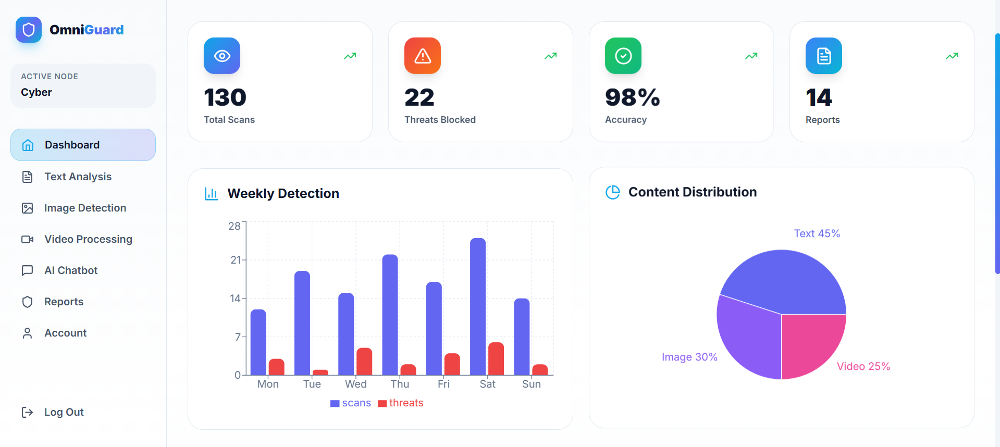
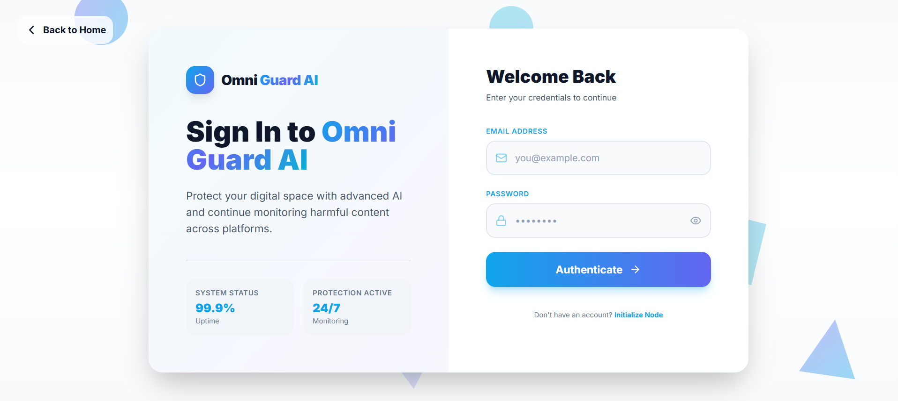

# Omni Guard AI - Cyberbullying Detection System

<div align="center">
  
</div>

---

## 📖 Table of Contents
1. [Overview](#overview)
2. [Features](#features)
3. [Tech Stack](#tech-stack)
4. [Project Structure](#project-structure)
5. [Setup Instructions](#setup-instructions)
6. [Screenshots](#screenshots)
7. [API Endpoints](#api-endpoints)
8. [Usage](#usage)
9. [Contributing](#contributing)

---

## 🌍 Overview

**Omni Guard AI** is an advanced AI-powered cyberbullying detection system that analyzes text, images, and videos to identify harmful content in real-time. Our mission is to create a safer digital environment by leveraging cutting-edge machine learning models and natural language processing techniques.

---

## ✨ Features

### 📝 Text Analysis
- Uses Toxic BERT and Groq API for comprehensive text toxicity detection
- Provides detailed reasoning and confidence scores
- Safe content always shows 70%+ confidence

### 🖼️ Image Detection
- Combines EasyOCR text extraction and OpenAI CLIP vision analysis
- Dual-branch pipeline for accurate content analysis
- Gemini API fallback for uncertain cases

### 🎥 Video Processing
- Smart frame sampling at 20%, 40%, 60%, 80% marks
- Early exit logic for efficient content review
- Frame-by-frame analysis with animated results

### 📰 Live News Integration
- Fetches relevant news about cyberbullying and online safety
- 3-hour cache to save API quota
- Refresh button for latest updates

### 🤖 AI Chatbot
- Project-specific support and assistance
- Empathetic responses for mental health support
- Answers questions about features and usage

### 📊 Reports & History
- LocalStorage-based scan history
- Clear history functionality
- User-friendly dashboard

---

## 🛠️ Tech Stack

### Backend
- **Framework**: FastAPI
- **Database**: SQLite with SQLAlchemy
- **AI Models**: 
  - Toxic BERT (text)
  - OpenAI CLIP (vision)
  - EasyOCR (text extraction)
  - Google Gemini API (fallback)
  - Groq API (text reasoning)
- **Libraries**:
  - `transformers`
  - `torch`
  - `easyocr`
  - `google-generativeai`
  - `groq`
  - `httpx`
  - `python-dotenv`

### Frontend
- **Framework**: React 18 + TypeScript
- **Styling**: Tailwind CSS
- **Animations**: Framer Motion
- **Icons**: Lucide React
- **Build Tool**: Vite
- **Router**: React Router DOM

---

## 📁 Project Structure

```
AI CyberBullying/
│
├── backend/
│   ├── app/
│   │   ├── ai/               # AI model integrations
│   │   ├── database/         # Database configuration
│   │   ├── models/           # SQLAlchemy models
│   │   ├── routes/           # API routes
│   │   │   ├── auth.py       # Authentication routes
│   │   │   ├── detection.py  # Text detection
│   │   │   ├── image_routes.py
│   │   │   ├── video_routes.py
│   │   │   ├── news_routes.py
│   │   │   └── health.py
│   │   ├── schemas/          # Pydantic schemas
│   │   ├── services/         # Business logic
│   │   │   ├── text_service.py
│   │   │   ├── image_service.py
│   │   │   ├── video_service.py
│   │   │   └── news_service.py
│   │   ├── utils/
│   │   └── main.py           # FastAPI entry point
│   ├── uploads/              # File uploads directory
│   ├── requirements.txt
│   └── .env
│
├── frontend/
│   ├── src/
│   │   ├── components/       # Reusable components
│   │   │   ├── Navbar.tsx
│   │   │   ├── Footer.tsx
│   │   │   ├── SideMenu.tsx
│   │   │   └── FeatureCard.tsx
│   │   ├── pages/            # Page components
│   │   │   ├── Home.tsx
│   │   │   ├── Dashboard.tsx
│   │   │   ├── TextAnalysis.tsx
│   │   │   ├── ImageDetection.tsx
│   │   │   ├── VideoProcessing.tsx
│   │   │   ├── Reports.tsx
│   │   │   ├── Chatbot.tsx
│   │   │   └── ...
│   │   ├── App.tsx
│   │   ├── main.tsx
│   │   └── index.css
│   ├── package.json
│   ├── tailwind.config.js
│   └── vite.config.ts
│
├── Images/                   # Screenshots
│   ├── Home Page.png
│   ├── Dashboard.png
│   ├── Text Analysis.png
│   ├── Image Analysis.png
│   ├── Video Analysis.png
│   └── Login.png
│
└── uploads/                  # Uploaded files
```

---

## 🚀 Setup Instructions

### Prerequisites
- Python 3.10+
- Node.js 18+
- npm or yarn

### Backend Setup

1. **Navigate to the project directory**
   ```bash
   cd "d:\Projects 2026\FYP\Trae\AI CyberBullying"
   ```

2. **Create a virtual environment**
   ```bash
   python -m venv venv
   ```

3. **Activate the virtual environment**
   - On Windows:
     ```bash
     venv\Scripts\activate
     ```
   - On macOS/Linux:
     ```bash
     source venv/bin/activate
     ```

4. **Install dependencies**
   ```bash
   pip install -r requirements.txt
   ```

5. **Set up environment variables**
   Create a `.env` file in the root directory (if not already present) with the following:
   ```env
   DATABASE_URL=sqlite:///./cyberbullying_new.db
   UPLOAD_DIR=./uploads
   GROQ_API_KEY=your_groq_api_key
   GEMINI_API_KEY=your_gemini_api_key
   NEWS_API_KEY=63b3c1ad1c81466497b1843f418fad40
   ```

6. **Run the backend server**
   ```bash
   uvicorn backend.app.main:app --reload
   ```
   The server will start at `http://127.0.0.1:8000`

### Frontend Setup

1. **Navigate to the frontend directory**
   ```bash
   cd frontend
   ```

2. **Install dependencies**
   ```bash
   npm install
   ```

3. **Start the development server**
   ```bash
   npm run dev
   ```
   The frontend will start at `http://localhost:3000` (or another port if 3000 is in use)

---

## 📸 Screenshots

### 🏠 Home Page
<div align="center">
  
</div>

---

### 📊 Dashboard
<div align="center">
  
</div>

---

### 📝 Text Analysis
<div align="center">
  
</div>

---

### 🖼️ Image Detection
<div align="center">
  
</div>

---

### 🎥 Video Processing
<div align="center">
  
</div>

---

### 🔐 Login Page
<div align="center">
  
</div>

---

## 📡 API Endpoints

### Authentication
- `POST /api/v1/auth/signup` - User registration
- `POST /api/v1/auth/login` - User login

### Detection
- `POST /api/v1/detection/text` - Analyze text
- `POST /api/v1/detection/image` - Analyze image
- `POST /api/v1/detection/video` - Analyze video
- `GET /api/v1/news` - Get latest news (supports `force_refresh` query param)

### Health Check
- `GET /health` - Check API status
- `GET /` - Welcome message

### API Documentation
- Swagger UI: `http://127.0.0.1:8000/docs`
- ReDoc: `http://127.0.0.1:8000/redoc`

---

## 💡 Usage

1. **Sign Up / Login**  
   Create an account or log in to access the dashboard.

2. **Analyze Text**  
   Navigate to Text Analysis, enter your text, and click "Analyze Text".

3. **Analyze Images**  
   Go to Image Detection, upload an image, and click "Analyze Image".

4. **Analyze Videos**  
   Visit Video Processing, upload a video, and click "Process Video".

5. **View Reports**  
   Check your scan history in the Reports page.

6. **Chat with AI**  
   Use the AI Chatbot for assistance and support.

7. **Read News**  
   Stay updated with the latest cyber safety news in the News section.

---

## 🤝 Contributing

Contributions are welcome! Please feel free to submit a Pull Request.

---

## 📄 License

This project is for educational purposes as part of a Final Year Project (FYP).

---

## 🙏 Acknowledgments

- OpenAI for CLIP
- Google for Gemini API
- Groq for text reasoning
- Hugging Face for Toxic BERT
- EasyOCR for text extraction

---

<div align="center">
  <p>Made with ❤️ for a safer digital world</p>
</div>